# Deck Content

Text-based version of all presentation content.

---

## 1. Cover

# Terrence Breschi

Portfolio review for **Baseten**

### Navigation

1. **About** — Background and what I'm looking for
2. **Assistant** — Elevating the UX at Personio
3. **Drawbridge** — Visual task annotation for AI coding agents

---

## 2. About

### The Through-Line

**From entrepreneur to designer who ships**

| Phase | Description |
|-------|-------------|
| Entrepreneur | Built websites and client relationships |
| Yahoo | Learned front-end engineering |
| Classy | Led design for nonprofit fundraising (acquired by GoFundMe) |
| Meta | Drove SMB growth in Ads and Avatars UX |
| Mary MacGill | E-commerce, 25% YoY growth in 2024 |
| Personio | First designer to ship code |

---

#### Entrepreneur

**Built websites and client relationships**

- **Founded web agency** — Managed end-to-end client projects from pitch to launch
- **Full-stack builder** — Design, development, and business operations
- **Client partnerships** — Learned to translate business needs into digital solutions

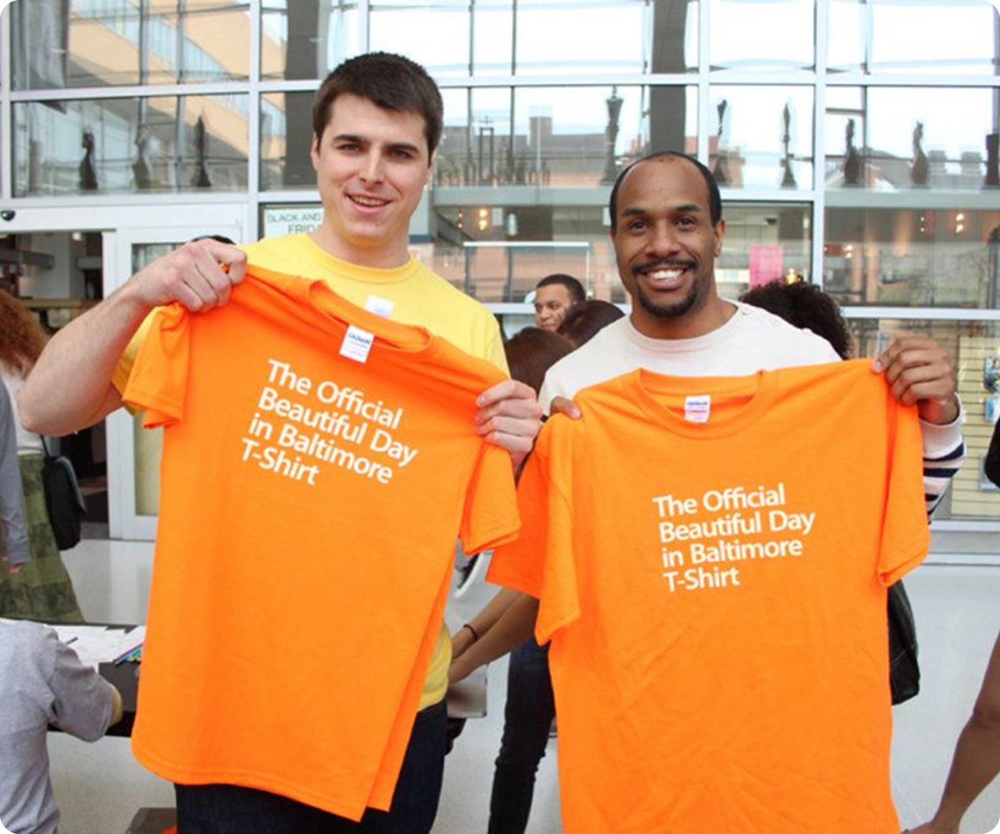

---

#### Yahoo

**Learned front-end engineering**

- **Built internal tools** — Built features reaching thousands of employees
- **Technical craft** — Honed front-end skills in a large engineering org
- **Cross-functional work** — Collaborated with PMs, designers, and backend engineers

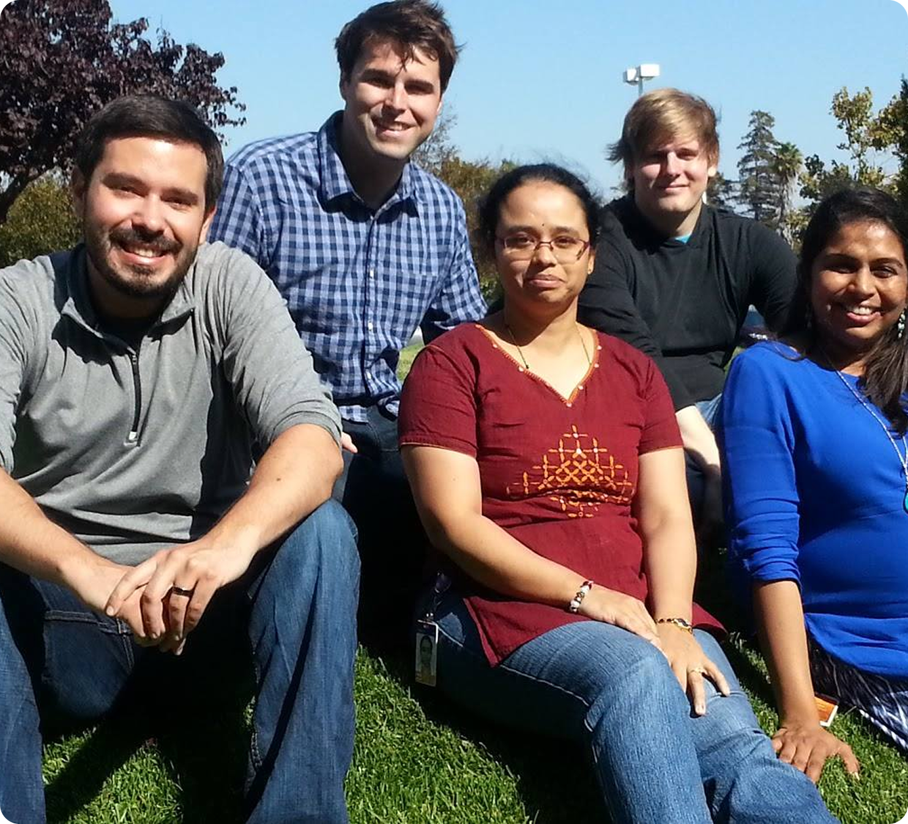

---

#### Classy

**Led design for nonprofit fundraising**

- **Design leadership** — Owned product design for fundraising platform
- **Mission-driven work** — Helped nonprofits raise billions for causes
- **Acquisition by GoFundMe** — Scaled design org through successful exit

---

#### Meta

**Drove SMB growth in Ads and Avatars UX**

- **Ads Manager** — Designed experiences helping small businesses grow
- **Avatars** — Led UX for self-expression across Meta platforms
- **Drove visibility with key leaders**

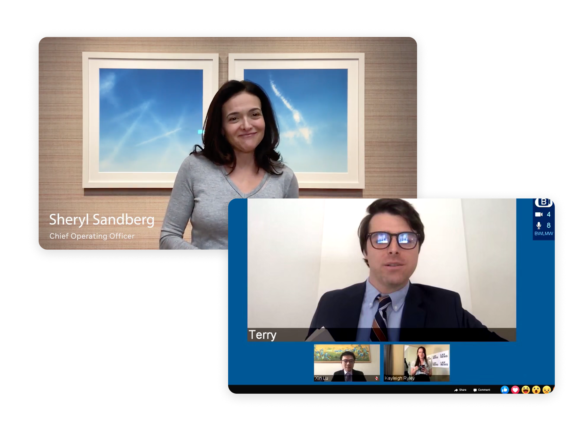

---

#### Mary MacGill

**E-commerce, 25% YoY growth in 2024**

- **Hands-on execution** — Full ownership of digital experience
- **Measurable impact** — Drove 25% year-over-year revenue growth
- **End-to-end design** — Strategy through implementation

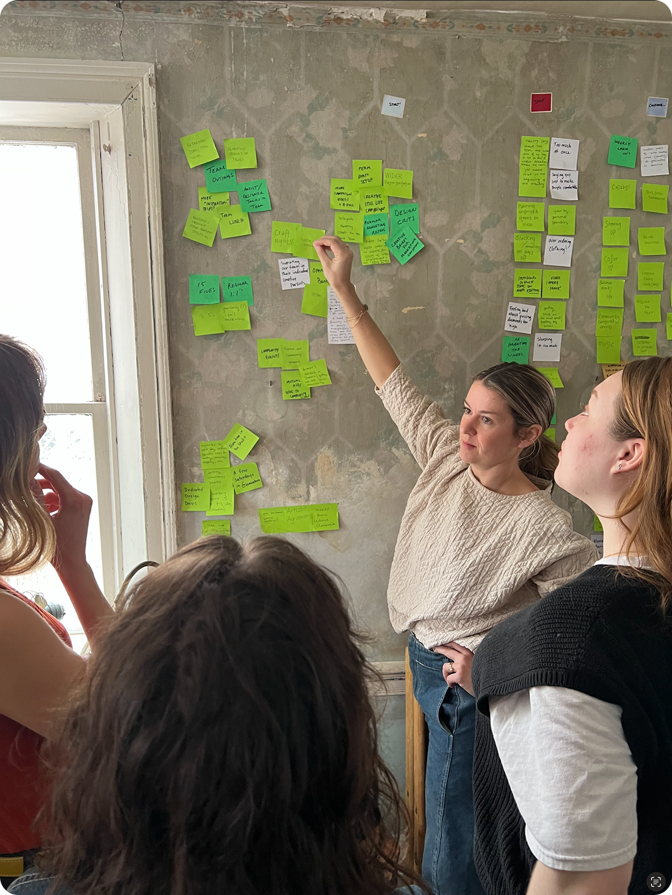

---

#### Personio

**First designer to ship code**

- **AI-first design** — Shaped product strategy for AI assistant
- **Designer who codes** — First designer to ship production code
- **Principal IC** — Technical leadership that spans Design and Engineering

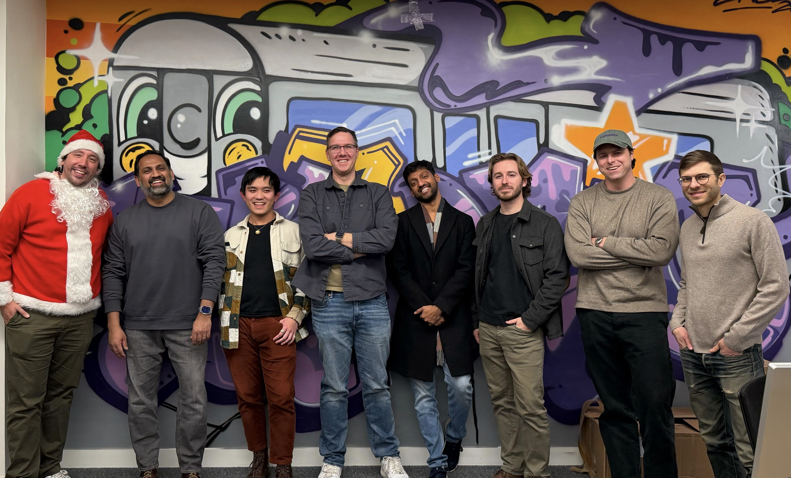

---

#### Outside Work

**Creativity doesn't clock out**

- **Drummer** — I love to keep a beat that others can build on.
- **Painter** — Abstract work, mostly. The only place I don't optimize for outcomes.
- **Dog dad** — Two rescues with my wife in NYC. They keep me honest about work-life balance.

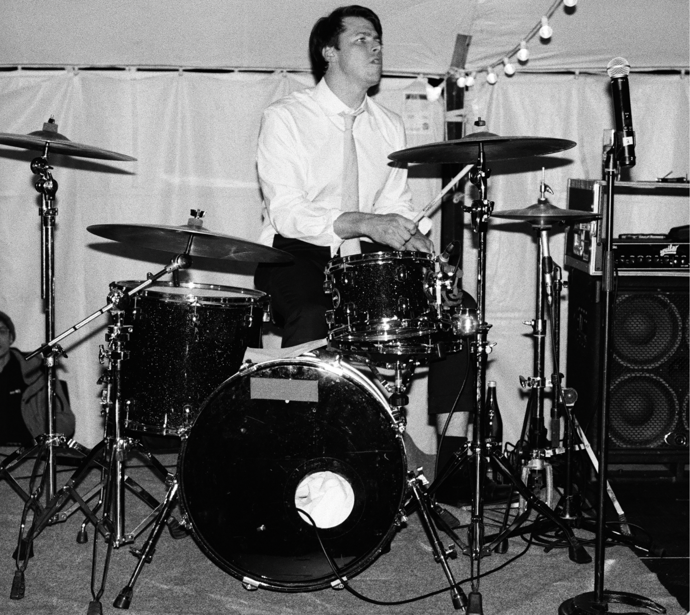

---

#### What I'm Looking For

> "**AI-first** projects. **AI-native** teams. People excited about the technology and committed to doing it safely."

---

## 3. Personio Assistant

# Personio Assistant

Overview of several enhancements I shipped directly to production—becoming the first designer at Personio to commit code.

| Role | Timeline | Tools |
|------|----------|-------|
| Principal Product Designer | May – December 2025 | Figma, Cursor |

---

### Context

---

#### Customers want an AI strategy

1. **Should be reliable** — Answers questions about headcount, retention, and team trends. + Agentic workflow.
2. **Hired to enhance the experience** — Brought on as Principal Designer to elevate the experience to industry standards.
3. **Joined a great team** — 4 ML engineers, 1 FE engineer, 1 product designer.

---

### Challenge

---

#### The Inheritance

**Beautiful Figma files, unrealized in production.**

Complex implementations were compromised or abandoned. Basic UX went unfixed while the team worked on higher-fidelity craft.

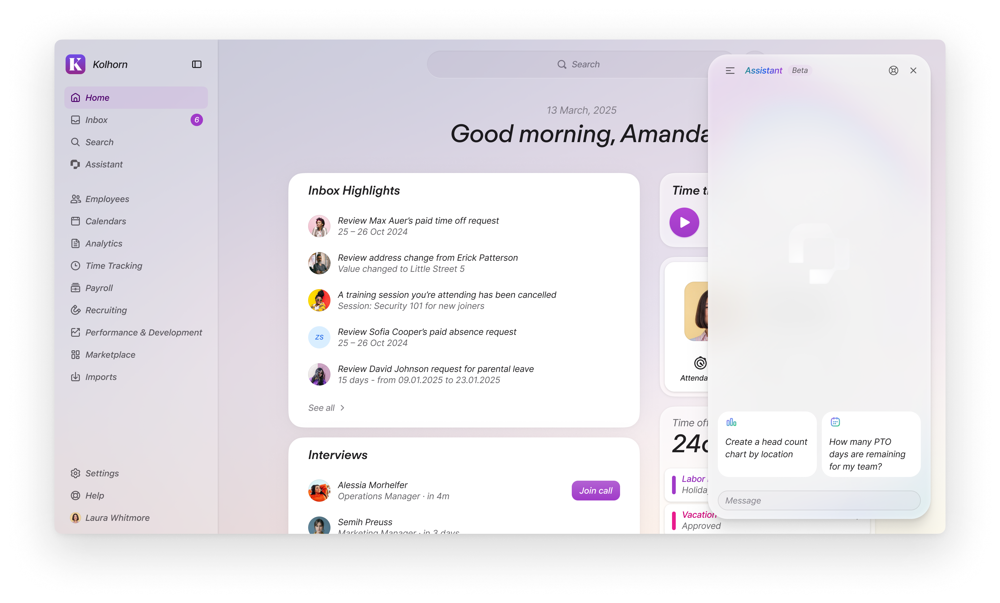

---

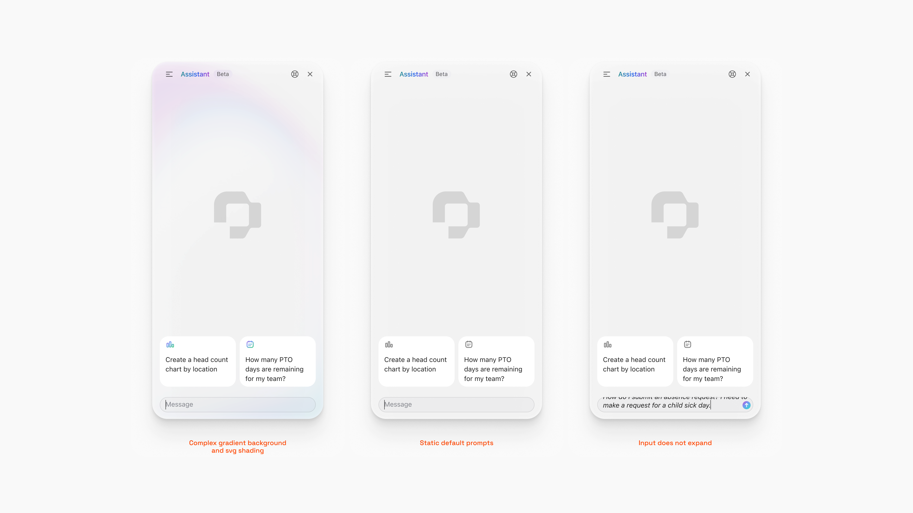

---

#### The Wake-Up

> "AI driven design can help me close the gaps between **design intent** and production"

---

### Journey

---

#### "It's not how it looks—it's how it works."

1. **Obvious gaps** — There were clear issues that could be improved upon.
2. **Figma didn't close the gap** — Beautiful files didn't translate to production.
3. **Functional prototypes** — May help close the gap where static designs failed.

---

#### The Push to Commit

**"You could be the first designer at Personio to commit code."**

- **I bit** — First fix: background color of instructions sent to the assistant
- **Learned PRs** — FE engineer walked me through the PR process
- **Fast iteration** — Iterating in Cursor was so fast I felt guilty asking my engineer

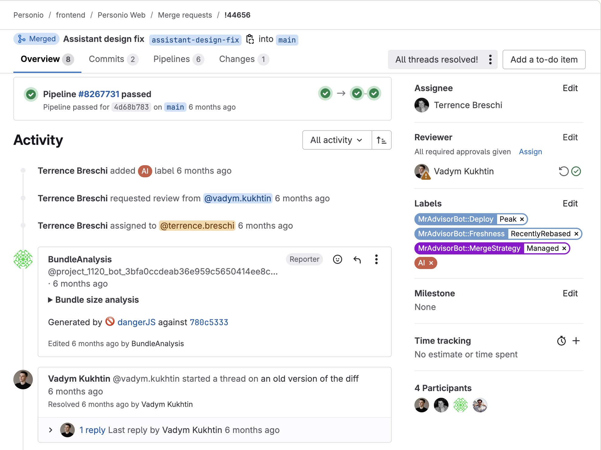

---

### Key Decisions

---

#### Aiming for Impact

1. **CEO frustration** — Saw a Slack post from the CEO frustrated with long text handling.
2. **Small enough to tackle** — Confident I could fix it without major architectural changes.
3. **Visible to leadership** — A fix that would be noticed at the executive level.
4. **Maximum signal, minimum risk** — High-impact, low-risk approach to prove the concept.

---

#### Feature 1: Welcome Mat

**Problem:** Static admin prompts didn't match what employees needed.

**Solution:** Employee-relevant starter prompts that demonstrate capabilities.

---

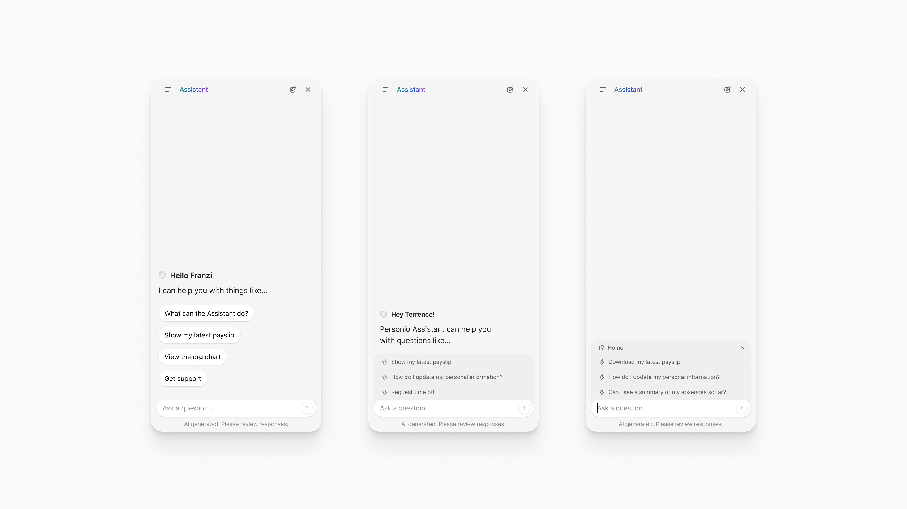

---

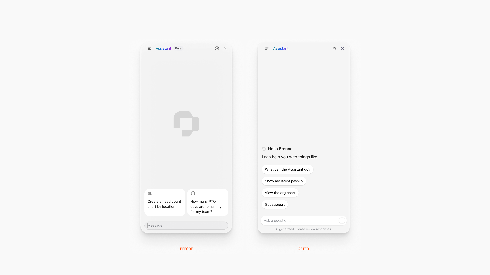

---

#### Feature 2: Flexible Input

**Problem:** Single-line field truncated questions, hid text as users typed.

**Solution:** Flexible field that grows dynamically, ~4 lines visible before truncation.

---

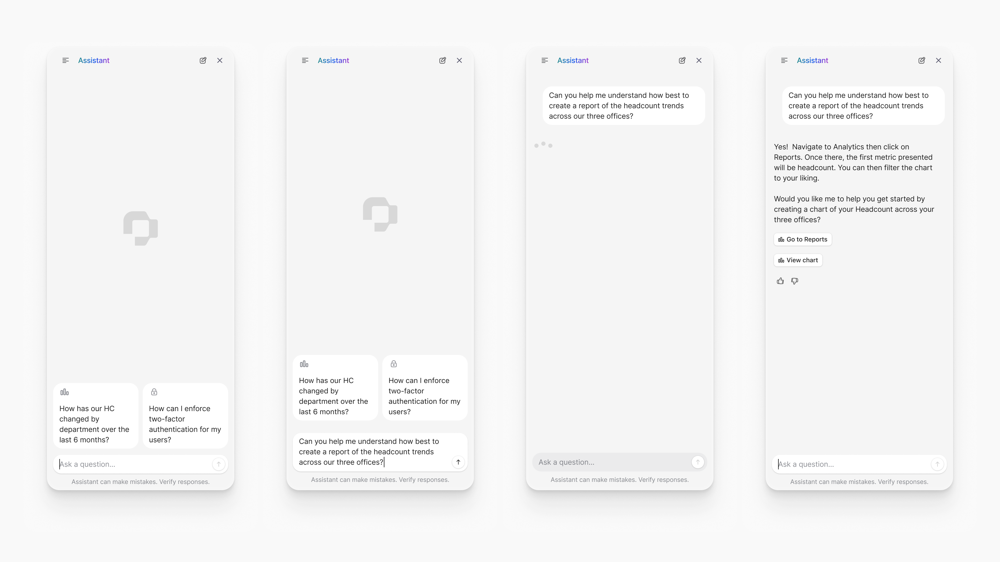

---

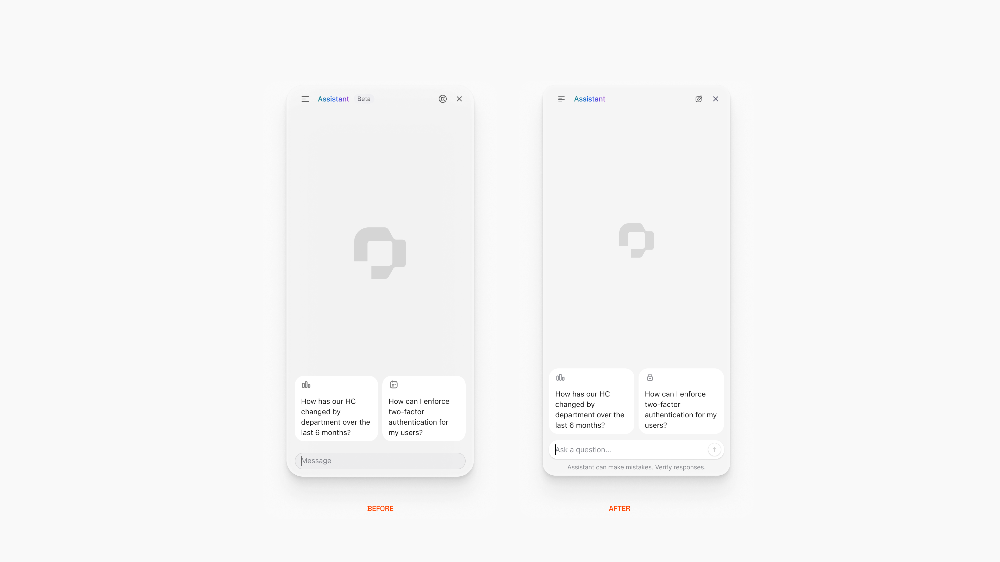

---

#### Feature 3: Flow Direction

**Problem:** Responses streamed bottom-to-top.

**Solution:** Top-to-bottom streaming + scroll-to-bottom button for long responses.

---

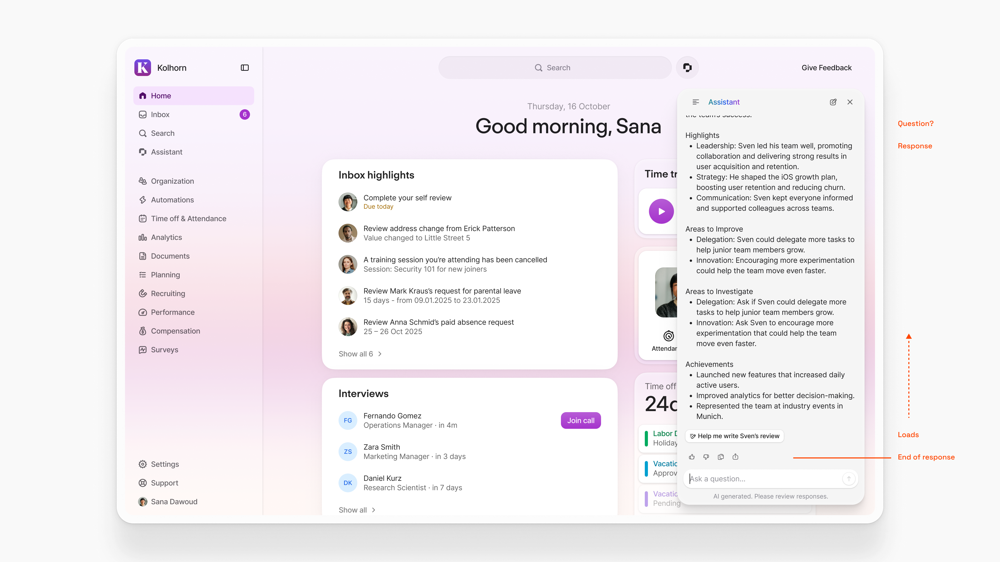

---

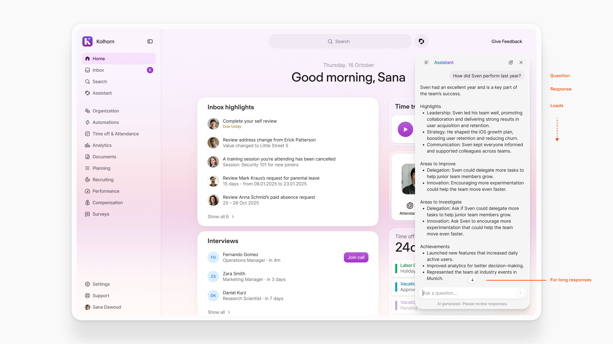

---

#### Feature 4: Citations

**Problem:** No way to verify where information came from.

**Solution:** Inline source citations so users can verify and build trust.

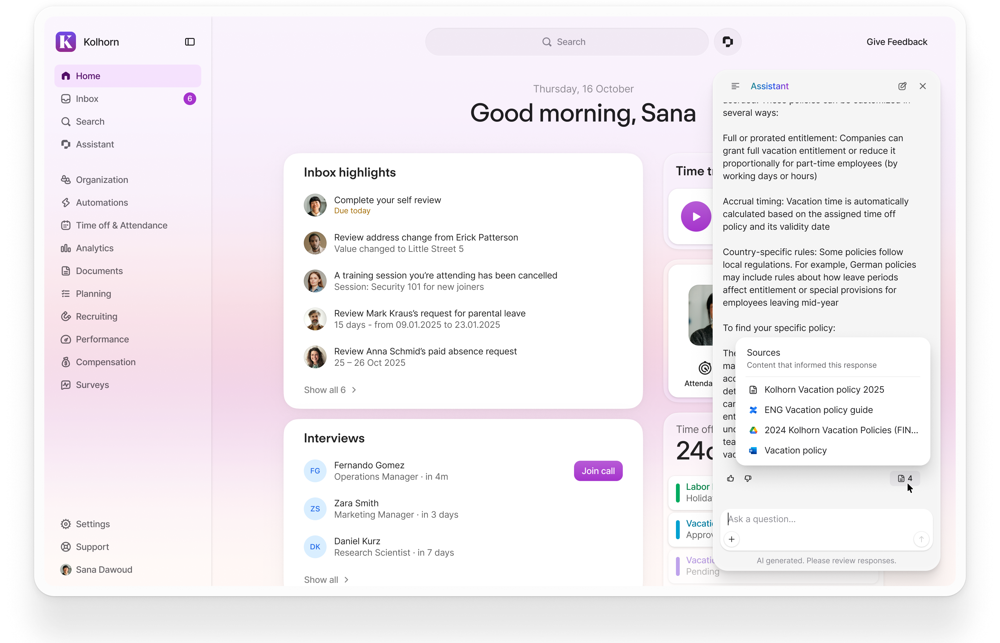

---

#### Feature 5: Stop Button

**Problem:** Forced to wait even when model was off track.

**Solution:** Visible stop button during streaming—users can interrupt anytime.

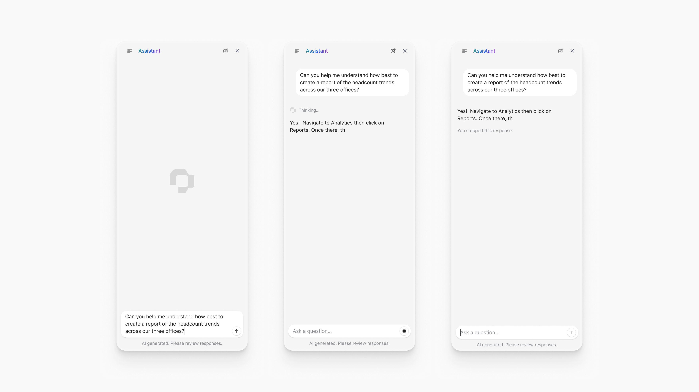

---

#### Feature 6: Navigation Button

**Problem:** Assistant described actions but left users to navigate manually.

**Solution:** "Take action" button navigates directly to relevant screen.

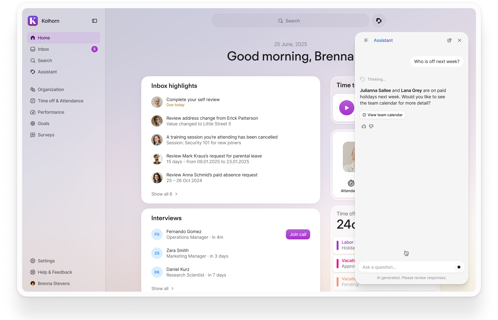

---

#### Feature 7: Error Handling

**Problem:** Generic errors, no timestamps, hard to share with support.

**Solution:** Descriptive explanations + timestamps + copy-to-clipboard.

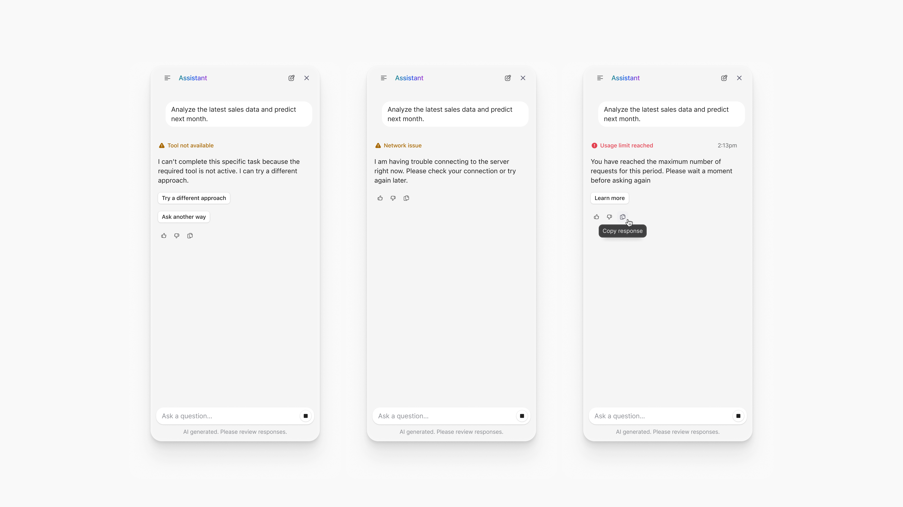

---

### Impact

---

#### CSAT: 19% → 22%

(+16% relative improvement)

Modest—model accuracy didn't change. But it proved: **UX was no longer the bottleneck.**

---

#### CSAT Breakdown

Detailed view of customer satisfaction improvements across the measurement period.

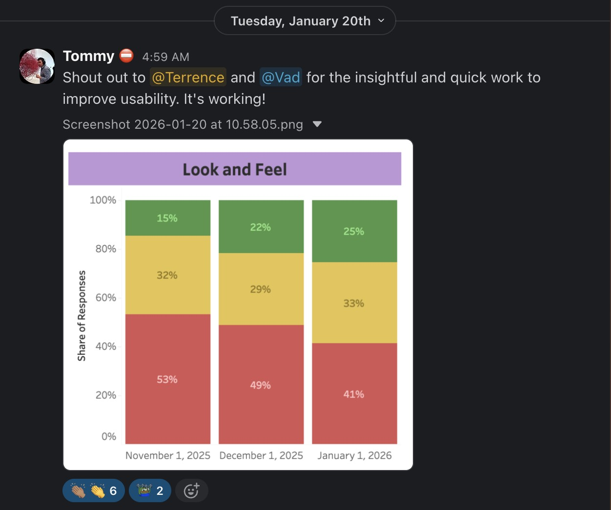

---

#### Organizational Impact

- **Developed a tutorial** — Created documentation for other designers to follow
- **Gave talk to design org** — Presented to the entire design organization
- **5-10 designers now ship code** — I'm no longer the only designer at Personio who commits code

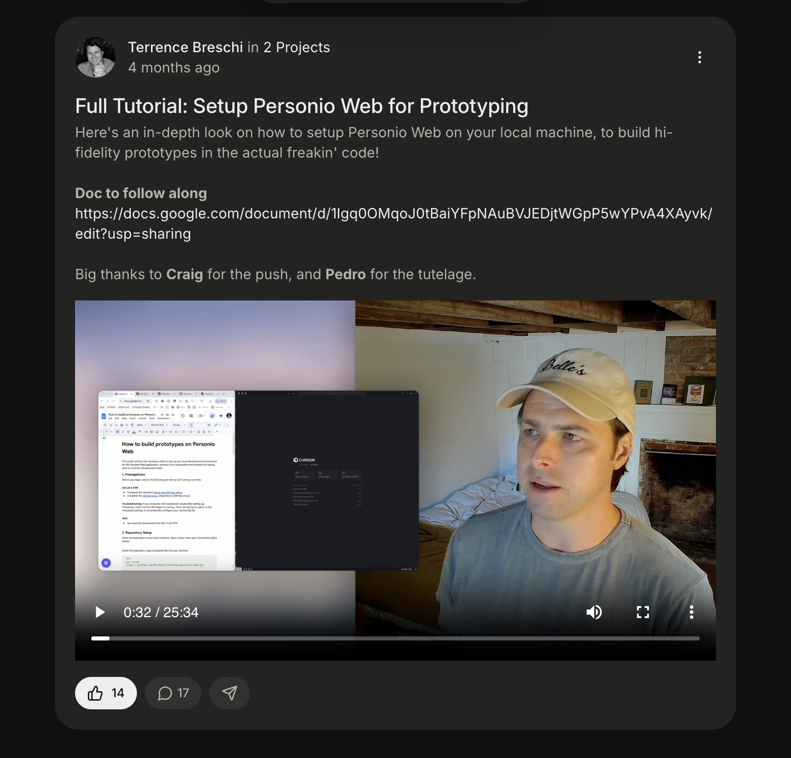

---

### Reflection

---

#### What's Next

These UX wins bought time. They proved I could ship.

But they also taught me where the real problems lived.

**Presentation 2: Drawbridge** — Solving my own problems with development tools

---

## 4. Drawbridge

# Drawbridge

Visual annotations for AI-assisted coding — making UI iteration 10x faster.

| Role | Timeline | Stack | Github |
|------|----------|-------|--------|
| Designer, Engineer | Jun–Dec 2025 | Chrome Extension, JS | breschio/drawbridge |

---

#### The Problem

**2-3 minutes per UI tweak**

Describing visual changes to AI took forever. Identify the element, explain what to change, wait for response, check result, repeat.

Annotated screenshots helped, but added their own overhead. And the AI was still guessing which element you meant.

---

#### How it works

Select elements, leave comments, run `bridge` in your editor. The AI handles the rest.

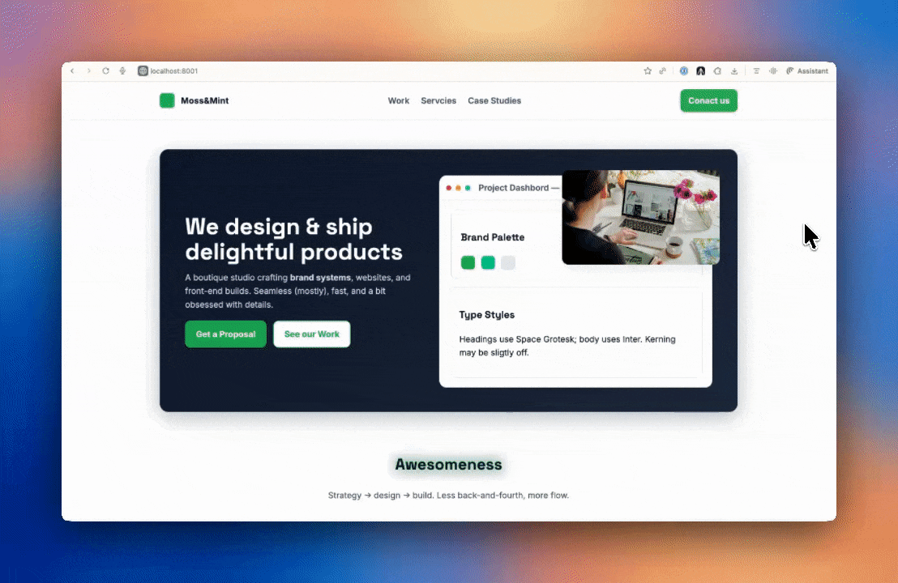

---

#### The Solution: Annotate → Queue → Execute

1. **Select DOM elements** directly in the browser
2. **Leave comments** describing the change
3. **Queue into a "moat"** that syncs to your project
4. **Run `bridge`** to process the entire queue

---

#### Run "bridge" in Cursor or Claude

A structured workflow reads a rich JSON prompt and screenshots stored in a .gitignore file

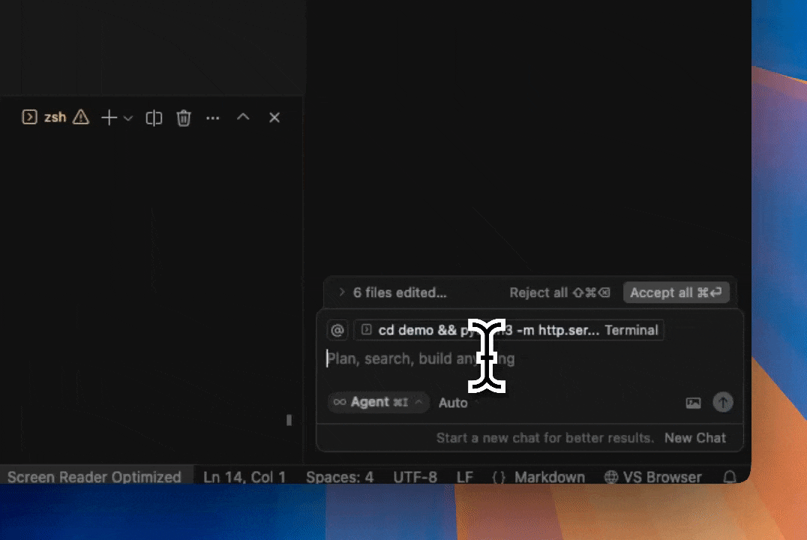

---

> "The AI needed **structural** context, not just **visual** context."

A screenshot shows you a button. The DOM tells you it's `div.hero-section > button.cta-primary`

---

#### Technical Decisions: Key features

- **Native screenshot API** — Chrome's `captureVisibleTab` over html2canvas
- **Freeform rectangles** — For annotations that don't map to a single element
- **Dependency detection** — Same-element annotations process in order

---

#### Results: 10x faster iteration

What took 2-3 minutes per change now takes 2-3 minutes for 10 changes.

| GitHub stars | Forks | Releases shipped |
|--------------|-------|------------------|
| 573 | 38 | 5 |

---

#### Featured: AI LABS tutorial

10-minute deep dive on a 107K-subscriber channel.

| Views | Likes |
|-------|-------|
| 17K | 561 |

---

#### Community Response: Strong organic traction

Within weeks of the video, my repo began gaining traction.

- Contributors fixing bugs and adding features
- I have learned how to maintain open source software

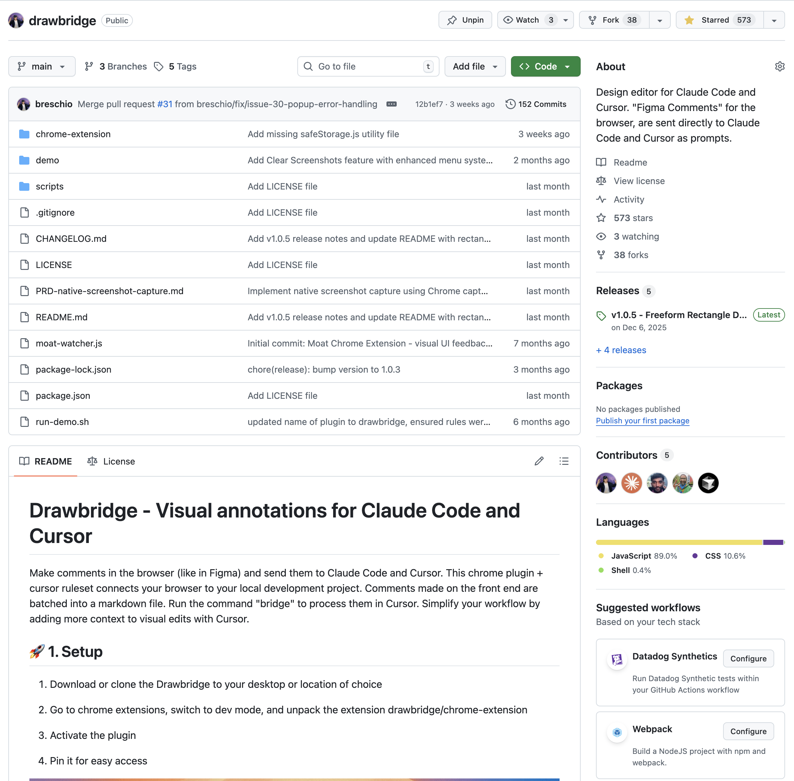

---

#### What I Learned: Key takeaways

- **"Go deeper."** Visual annotation wasn't enough — you need the image and the selector.
- **Build for yourself first.** I knew the problem because I lived it daily.
- **Open source until proven valuable.** Stars and organic coverage validate the problem exists.

---

## 5. Personio Agent (PAX)

# Personio Agent

"PAX" is a Chrome extension prototype that demonstrated capabilities our production AI assistant couldn't match—built in two afternoons.

| Role | Timeline | Build Time | Tools | Models |
|------|----------|------------|-------|--------|
| Principal Product Designer | December 2024 – Present | ~8 hours | Cursor IDE | Claude Opus 4.5, Sonnet 4.5 |

---

### Context

---

#### The Stakes

- Personio AI Assistant: **19% CSAT**
- CEO and COO sending screenshots of wrong answers to the team
- After layoffs eliminated 80% of US workforce, AI team spared
- Message was clear: **"AI is a priority"**

![PLACEHOLDER: CEO/COO Slack messages showing frustration]

---

#### What I Had Already Done

- Shipped **6 UX improvements** to production
- CSAT moved from 19% → 22% (16% relative increase)
- CEO gave thumbs up in Slack
- Manager elevated me to teach other designers to ship code

![PLACEHOLDER: CSAT breakdown chart]

---

#### The CSAT Story

- **Overall CSAT: 19% → 22%** — 16% relative improvement after UX changes shipped
- **Look & Feel: Improved** — Users noticed the interface improvements
- **Answer Accuracy: Flat** — "The UX got better. The answers didn't." This told me the problem was deeper than interface

![PLACEHOLDER: CSAT metrics visualization]

---

#### The AI didn't work

1. **UX fixes helped** — We were able to get marginal gains from UX improvements.
2. **Assistant gets it wrong** — Simple requests for "my latest payslip" still failed.
3. **Architecture was unclear** — Yet previous leadership had promised an "agentic future".

---

### Challenge

---

#### Move fast and learn things.

1. **UX fixes helped** — UX improvements nudged CSAT up, but users still didn't trust the answers.
2. **AI still got it wrong** — Even simple, high-value requests like "find my latest payslip" continued to fail.
3. **Architecture was unclear** — There was a promise of an "agentic future," but no clear path from today's architecture to that vision.

---

#### My First Attempt Failed

I figured I could rip out the API endpoint and swap in GPT with AgentKit.

- I built a branch off production
- Got it partially working—replaced the API endpoint
- Hit a wall: assistant couldn't see page content
- Confirmed with front-end engineer: **architecturally isolated** from the app

![PLACEHOLDER: Architecture diagram showing isolation]

---

> "The problem wasn't the brain. **It was the eyes.**"

---

#### I stepped away

**Turned to work on Drawbridge, a chrome extension used to batch visual edits to Claude.**

- Stuck and dependent on engineering
- No clear path forward
- Do a fun thing

![PLACEHOLDER: Drawbridge project screenshot]

---

> "What if I built the assistant as a **Chrome extension** instead of fighting to embed it in the app?"

Using the sidePanel API was a solution I was mulling over for Drawbridge.

---

#### The Hypothesis

1. **Context is foundational** — The assistant can't be agentic without knowing where it is and what's on the page.
2. **Side panel is a proposed layout** — Industry standard, always visible alongside content, reflects page context.
3. **Responsive feasibility** — Would existing pages adapt? This prototype would reveal design debt.

---

![PLACEHOLDER: Embedded assistant mock-up]

*early mock-up of "embedded assistant" in app*

---

### Journey

---

#### Two Day Build

December 16-17, 2025

1. **Day 1** — Chrome extension scaffolding, page context capture, Claude API connection.
2. **Day 2** — Structured context system, navigation map, initial workflows.
3. **Tools** — Cursor + Claude Opus 4.5 + Sonnet 4.5. ~8 hours total.

---

![PLACEHOLDER: Chrome extension prototype]

*Chrome extension prototype in action*

---

#### It Worked Almost Immediately

- Page context reading worked on first attempt
- Could answer questions about visible content

![PLACEHOLDER: Side-by-side: production fails, PAX succeeds]

---

#### PAX needs a map

- Before the map: constant 404 errors
- Built navigation map in **30 minutes**
- After: agent navigated the entire app reliably

![PLACEHOLDER: Navigation map visualization]

---

#### Infinite looping

- **Task looping:** agent re-ran all previous tasks before completing the new one
- Required prompt engineering to bifurcate tasks and respond only to latest intent
- Continued iteration in spare time over following weeks

![PLACEHOLDER: Prompt iteration examples]

---

### Key Decisions

---

#### Why a Chrome Extension?

- **Page access:** activeTab permission gives full visibility
- **No obstruction:** Sidepanel sits alongside, not over
- **Bypass complexity:** Test AI in isolation from backend
- **Independence:** Build and prove concept without waiting

![PLACEHOLDER: PAX sidepanel interface]

---

> "No internal API access started as a limitation. Then it became a hypothesis. **The constraint forced discovery.**"

---

#### Why Make It Configurable?

- API key, model selection, system prompt—all adjustable
- Enables other teams to test their own hypotheses
- Supports a federated AI model: teams prove concepts before investing engineering resources
- PAX becomes a proving ground, not a bottleneck

![PLACEHOLDER: PAX settings interface]

---

#### Navigation Map as "Skill Injection"

- Alternative: let the agent figure out navigation on its own
- Chose to pre-load an explicit map of routes and UI elements
- **Saves tokens, avoids errors**
- Bounded context (Personio app, not the entire internet)
- 30 minutes to build, significant performance unlock

![PLACEHOLDER: Navigation map JSON structure]

---

### Impact

---

#### The Demo

Quarterly Planning Session

*Audience: Director of PM, Design Manager, Director of Engineering, Staff Engineers, PMs*

1. Question production assistant fails → **PAX answers correctly**
2. PAX navigating UI **autonomously**
3. "Request time off" workflow with agent **taking action**

![PLACEHOLDER: Request time off workflow video]

---

#### The Reaction

- "**Best demo they've seen**"
- "More impressive than what the team has done with thousands of hours"
- PM: "**Ship it**"
- Designer: "This is a no-brainer. What's stopping us from building this now?"

**Enthusiasm, not allocation.** The real work was just beginning.

![PLACEHOLDER: Slack reactions: 'ship it' and 'no-brainer' messages]

---

#### Translating Enthusiasm into Action

1. **Budget proposals** — Wrote proposals to move off personal API key.
2. **Requested official repo** — Created official repo in company GitHub.
3. **Pitched to CPO** — Positioned the project as a tool we could use for AI Strategy.

---

#### Proof It Works

Leadership retreat, January 2025

- Asked PAX to request a day off
- Navigated to right page, opened modal, selected dates, submitted
- **Worked end-to-end**
- Task the production assistant **still can't do**

PAX doesn't just demo well. It actually works.

![PLACEHOLDER: Request time off successful completion]

---

#### "Let's get it moved over..."

I positioned PAX as a tool for developing Personio's Vision for the next 2-3 years. This lead to internal support and funding.

![PLACEHOLDER: CPO Slack thread screenshot]

---

### Reflection

---

#### What I Learned

1. **The problem was structural, not technical** — Spent 1.5 weeks improving the brain before realizing it had no eyes.
2. **Side projects create leverage** — Drawbridge taught me techniques I applied at work.
3. **Building real beats building fake** — Previous vision work was scripted on a fake stack. I built something functional. That changed the conversation.

---

#### The Payslip Moment

**"Find my latest payslip"**—the task our assistant always fails.

- CEO and COO regularly complain about this bug
- Worked on it over 3-4 days in spare time
- At a leadership retreat, during a meeting, it finally worked
- Audible celebration. Then shared screenshots with PM, Engineering Director, and Design Manager.

![PLACEHOLDER: PAX successfully retrieving payslip]

---

> "I can build **[almost] anything** with enough patience and perseverance."

The Sidepanel API seemed out of reach until I tried. Personal projects that solve your own problems lead to unexpected insights. Constraints can accelerate discovery. Bias toward action, learn from failure, iterate.

---

#### What's Next

1. **Setup Company API for Claude** — Replace my personal API key in order to share with others.
2. **Evaluation framework** — PAX vs. production assistant on real use cases.
3. **Federated model** — Share PAX with other teams. Setup demos to teach others how to test.

---

> Thank you
